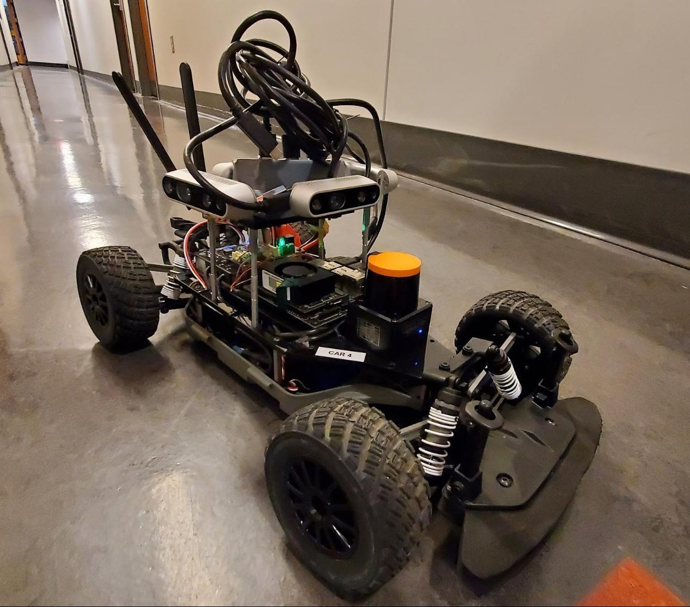
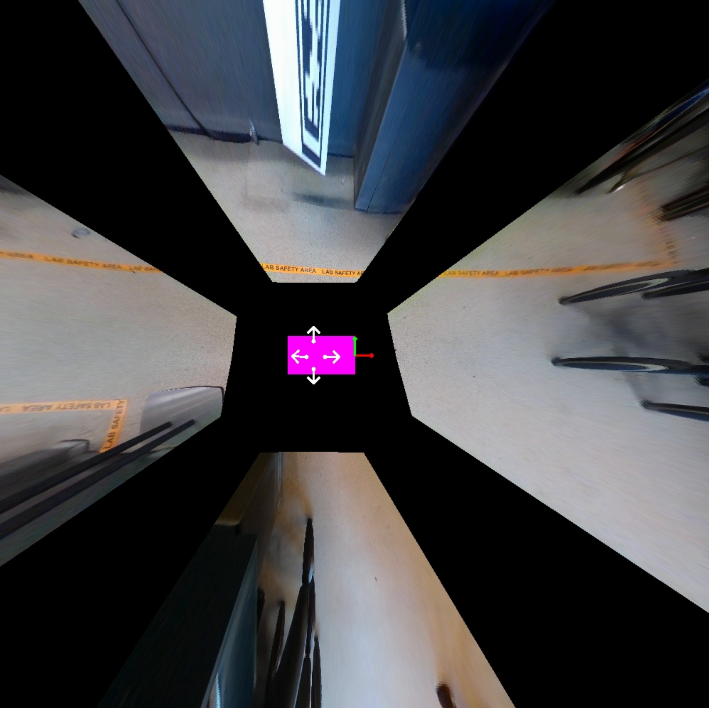

# F1Tenth IPM Project and ICRA2022
This repository showcases our ESE615 Spring 2022 F1Tenth coursework, Inverse Perspective Mapping (IPM) final project and software stack for the ICRA2022 F1Tenth competition. Most sofware is C++ and Python built ontop of ROS2 Foxy. Special thanks to the F1Tenth community, and Nicholas Marion, Archit Hardikar, and Ruchi Gupte for their contributions on this project. 
 
## F1Tenth Coursework 
The [F1Tenth course](https://f1tenth.org/) led by Professor Rahul Mangharam involves building a complete software stack for the F1Tenth open source racing platform. The course is focused on competition; everything must be built for speed. The course material includes explorations into reactive driving methods, localization, mapping, planning, and execution. The class culminated with a final race and a final project. For the final project teams of three were free to explore novel topics beyond the scope of pure race performance. 

## F1Tenth IPM Racing Project
For our final project, we elected to investigate Inverse Perspective Mapping as an alternative/supplimentary source of information for racing. In the final race for the class many teams struggled to distinguish between obstacles and the opponent racecar using only LIDAR. Thus, we sought to build a 360 degree camera module to track the opponent racecar and adjust our local trajectory accordingly. 

  

## F1Tenth ICRA2022 Competition
Following the completition of the coursework, I was fortunte to compete in the ICRA2022 F1Tenth Autonomous Race. Our software stack includes a global optimal raceline, local planner for collision detection/overtakes, and a particle filter for localization. 

 

### Pure Pursuit and Velocity Profile
At the highest level, the car follows a global optimal raceline using pure pursuit. The global map is constructed with Cartographer before the race begins. In addition to the raceline we calculate a velocity profile constructed from the curvature of the raceline. The speeds are tuned to hold high speeds through turns while still maintaining control of the car. 

 

### Collision Detection 
Because the ego car may encounter static obstacles or opponent vehicles the ego car is constantly checking if there is a collision free path on the raceline. If the path is blocked, the local planner switches to a gap follow approach until the ego car is free to continue on the raceline. 

